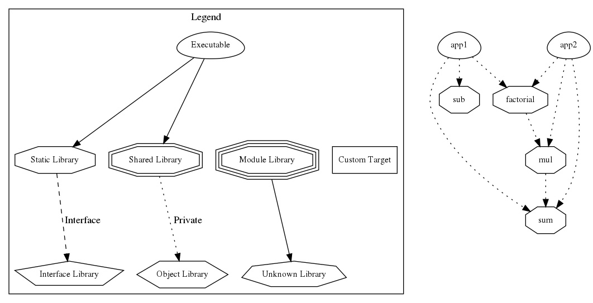

# CMake Example

An example cmake project to demonstrate relations between cmake targets.

We have libraries for sum, multiplication, factorial, and substraction. The
multiplcation library uses the sum library to implement multiplication
operation. The factorial library uses the multiplication library to compute the
factorial of a given integer. CMake regulates the relations between these
libraries without exposing more than their public interfaces. For example, the
factorial library doesn't know about the implementation details of the
multiplication library. If we change the the multiplication library to simply
use multiplication operator rather than utilizing the sum library, the factorial
library doesn't need any change at all. Each of these libraries are also tested
using GTest. GTest dependency is managed by conan, C/C++ package manager. We
have two client applications, app1 and app2. These applications use our
highly-modular, reusable, well-tested libraries.

As a summary, we divide each functional component into a library. We define
interfaces for these libraries in their header files. As we implement these
interfaces, we either write unit tests or alternatively, go for Test Driven
Development. We can also start writing applications when the library interfaces
reach to a certain level of stabilization. If applications are simple CLI apps,
CTest is enough to test their outputs with specified inputs. Otherwise, they
may require different integration testing strategies.



## Build

Assuming you have cmake and conan installed, run the following commands.

```
mkdir build
cd build
conan install ..
cmake -DCMAKE_BUILD_TYPE=Debug -DCMAKE_VERBOSE_MAKEFILE=ON ..
cmake --build ..
```

## Test

```
ctest --verbose
```

## Run

```
./bin/app1
./bin/app2
```
